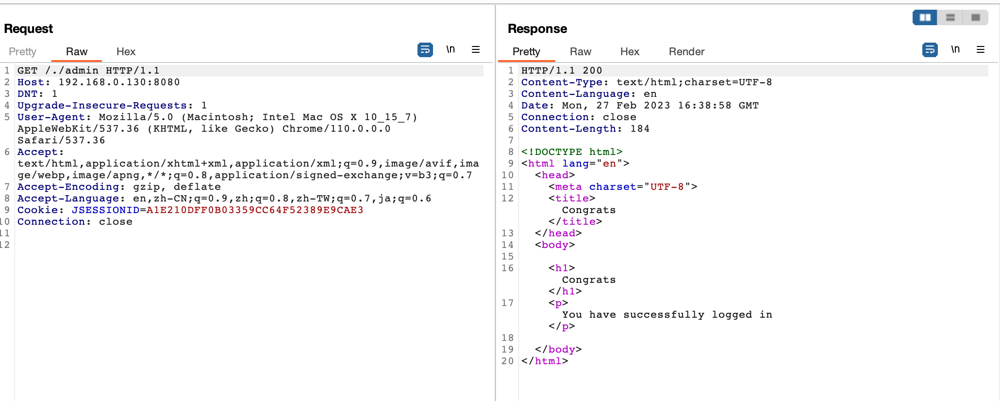

# Apache Shiro Authentication Bypass Vulnerability (CVE-2010-3863)

Apache Shiro is a powerful and easy-to-use Java security framework that performs authentication, authorization, cryptography, and session management.

Apache Shiro before 1.1.0, and JSecurity 0.9.x, does not canonicalize URI paths before comparing them to entries in the shiro.ini file, which allows remote attackers to bypass intended access restrictions via a crafted request, as demonstrated by the `/./`, `/../`, `/`, `//` URI.

References:

- <https://github.com/apache/shiro/commit/ab8294940a19743583d91f0c7e29b405d197cc34>
- <https://xz.aliyun.com/t/11633#toc-2>
- <https://cve.mitre.org/cgi-bin/cvename.cgi?name=CVE-2010-3863>

## Vulnerable Environment

Start an application with Spring and Shiro 1.0.0 by executing the following command.

```
docker-compose up -d
```

Once the environment is started, visit ``http://your-ip:8080`` to see the home page.

## Vulnerability Reproduce

A direct request to the admin page `/admin` is inaccessible and will be redirected to the login page.


Construct a malicious request `/./admin` to bypass authentication checks and access the admin page.


